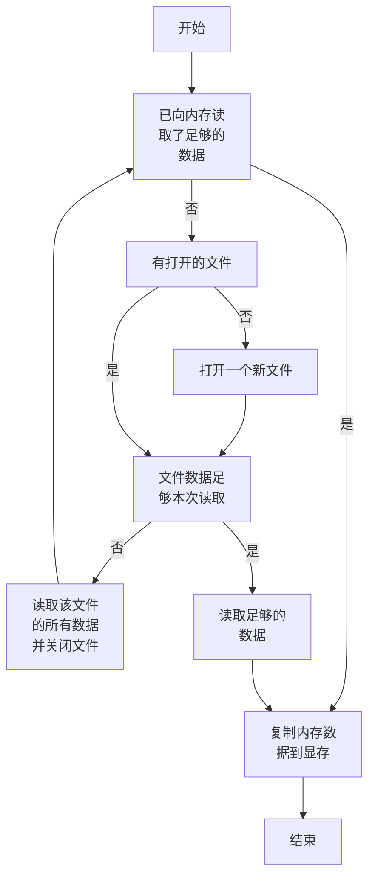

# 函数表

## readfile()

### 参数表

input_char_cpu:指向内存的指针,用作缓冲区(相当于文件与显存之间的中转站);

input_char_gpu:指向显存的指针;

file_list:文件名表,一个字符串数组;

size:需要读取的数据的大小,单位为字节.

### 功能

将文件名表(file_list)中列出的文件按照表内的次序抽象为一连续的输入流，每次调用时从流中复制指定大小(size)的数据到内存中，并将这些数据传输到显存中。

### 注意事项

input_char_gpu和input_char_gpu指向的内存和显存的应大于待复制的数据大小(size)。

### 具体的实现

#### 静态变量表

original_data:输入流，用于打开并读取文件;

file_number:跟踪当前打开的文件;

file_reamin_size:跟踪当前文件的剩余(未读取部分)大小.

#### 局部变量表

read_remain_size:跟踪剩余需要读取的数据大小

read_size:跟踪已读取的数据大小

#### 程序逻辑

## char2float_interlace()

### 参数表

input_char_gpu:指向显存的指针,用来输入数据​

fft_real:指向显存的指针,用来输出数据

batch:单个通道的数据并行的FFT变换的次数

fft_length:FFT变换的窗口大小

### 功能

将基带数据的排布和类型转换为进行FFT变换时所需要的形式，类型方面，将数据从signed char转换为half(半精度浮点数)，排布方面的转换则见以下示意图

下表列出了该步操作前后信号在显存中的排布情况，其中X、Y分别代表两个通道的数据，下标数字代表采样时间。

原来的信号排布(表1)：

| X1 | Y1 | X2 | Y2 | X3 | Y3 | X4 | Y4 | ...  | ...  | XBN-1 | YBN-1 | XBN | YBN |
| ------------- | ------------- | ------------- | ------------- | ------------- | ------------- | ------------- | ------------- | ---- | :--- | ---------------- | ---------------- | -------------- | -------------- |

调整后的信号排布(表2)(此处假设FFT窗口大小为N,batch为B)：

| X1            | X2            | ...     | XN-1      | XN      | 留空     | 留空     | Y1            | Y2            | ...     | YN-1      | YN      | 留空     | 留空     |
| ------------------------ | ------------------------ | ------- | -------------------- | ------------------ | -------- | -------- | ------------------------ | ------------------------ | ------- | -------------------- | ------------------ | -------- | -------- |
| **XN+1**      | **XN+2**      | **...** | **X2N-1** | **X2N** | **留空** | **留空** | **YN+1**      | **YN+2**      | **...** | **Y2N-1** | **Y2N** | **留空** | **留空** |
| **...**                  | **...**                  | **...** | **...**              | **...**            | **...**  | **...**  | **...**                  | **...**                  | **...** | **...**              | **...**            | **...**  | **...**  |
| **X(B-1)N+1** | **X(B-1)N+2** | **...** | **XBN-1** | **XBN** | **留空** | **留空** | **Y(B-1)N+1** | **Y(B-1)N+2** | **...** | **YBN-1** | **YBN** | **留空** | **留空** |

假设之后进行的FFT变换的窗口大小为N，则该变换需要输入N个实数，输出N/2+1个复数，这些复数总共占用N+2个实数的空间，因此需要在每N个读入的数据后留两个空位，以便之后进行原位FFT变换。

### 注意事项

fft_real指向的显存需要预留足够的空间(为input_char_gpu的2倍多)；

参数fft_length必须为1024的整数倍；

### 具体的实现

函数char2float_interlace()实际上为函数char2float_interlace_gpu()的封装，其把参数input_char_gpu,fft_real和fft_length直接传递给函数char2float_interlace_gpu()，并设置block大小为1024，grid大小为batch来调用函数char2float_interlace_gpu()。

## char2float_interlace_gpu()

### 参数表

input_char_gpu:指向显存的指针,用来输入数据​

fft_real:指向显存的指针,用来输出数据

fft_length:FFT变换的窗口大小

### 功能

完成char2float_interlace()的数据转换，具体而言，当设置block大小为1024，grid大小为batch来调用该函数时，block编号为1的1024个线程完成对表2中第1行数据的转换，block编号为2的线程完成第2行数据的转换，因此总计batch个block完成了对表2中所有数据的转换。

### 注意事项

参数fft_length必须为1024的整数倍；

调用该函数时必须设置block大小为1024；

由于函数char2float_interlace()已经提供了一个封装，因此不必显示调用该函数。

### 具体的实现

#### 局部变量表

input_grid_offset:追踪输入数据的不同FFT窗口之间的内存偏移量;

output_grid_offset:追踪输出数据的不同FFT窗口之间的内存偏移量;

input_block_offset:追踪输入数据的单个FFT窗口内的内存偏移量;

output_block_offset:追踪输出数据的单个FFT窗口内的内存偏移量.

注:由于输出的数据需要在每个FFT窗口内保留两个空位以便后续进行原位傅里叶变换，因此需要分开追踪输入和输出数据的内存偏移量。

#### 程序逻辑

此处使用表1和表2进行解说。(实际的block和线程编号都从0开始，此处为了与表格保持一致假定编号从1开始)，记m=N/1024。

block1负责表2中第1行的数据转换，该block内的线程1负责转换数据X1到Xm和Y1到Ym，线程2负责转换数据Xm+1到X2m和Ym+1到Y2m，直到线程1024负责转换数据XN-m+1到XN和YN-m+1到YN；block2负责表2中第2行的数据转换，以此类推。

#### main()

### 程序逻辑

#### NVCC的编译选项gencode,arch,code

